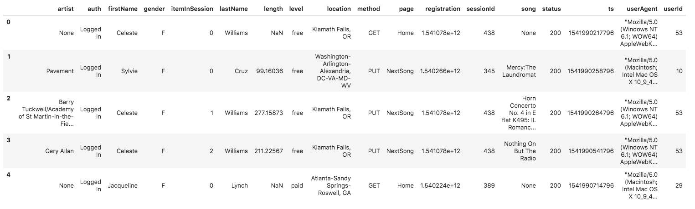
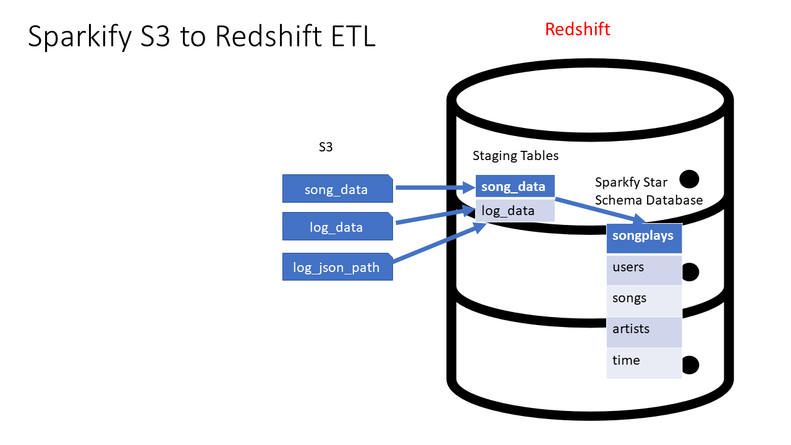

# Project 2: Sparkify 


### Tabela de Conteúdo
- [Project Summary](#Project-Summary)
- [Datasets](#Datasets)
- [Database Schema](#Database-Schema)
  - [Staging Table](#Staging-Table)
  - [Fact and Dimension Tables](#Fact-and-Dimension-Tables)
- [How to run](#How-to-run)
- [Scripts](###Scripts)


### Project Summary
A music streaming startup, Sparkify, has grown their user base and song database and want to move their processes and data into the cloud. Their data resides in S3, in a directory of JSON logs on user activity on the app, as well as a directory with JSON metadata on the songs in their app.
 
The project aims to **build an ETL pipeline** that **extracts data from S3**, makes it **available in Redshift** and transforms it into a set of **dimensional and factual tables** so that the analysis team can continue to obtain information about the music that users listen to.


During this project, three services from Amazon Web Services will be used:
* [AWS S3](https://aws.amazon.com/pt/s3/)
* [AWS Redshift](https://aws.amazon.com/pt/redshift/)
* [AWS IAM](https://aws.amazon.com/pt/iam/)

Regarding the sources used during the project, you can find them under [Datasets](#Datasets).


### Datasets
Three data sources were used, which are in public **S3 bucket**, and the objects contained in both buckets are JSON files.

Information about the *songs* and *artists* from the [Million Song Dataset](http://millionsongdataset.com/)
  * Song data: `s3://udacity-dend/song_data`
~~~~
song_data/A/B/C/TRABCEI128F424C983.json
song_data/A/A/B/TRAABJL12903CDCF1A.json
~~~~
Example:
~~~~
{"num_songs": 1, "artist_id": "ARJIE2Y1187B994AB7", "artist_latitude": null, "artist_longitude": null
, "artist_location": "", "artist_name": "Line Renaud", "song_id": "SOUPIRU12A6D4FA1E1", 
"title": "Der Kleine Dompfaff", "duration": 152.92036, "year": 0}
~~~~

Information about the *actions done by users*
  * Log data: `s3://udacity-dend/log_data`
  * This third file `s3://udacity-dend/log_json_path.json` contains the meta information that is required by AWS to correctly load s3://udacity-dend/log_data
~~~
log_data/2018/11/2018-11-12-events.json
log_data/2018/11/2018-11-13-events.json
~~~
Example:


### Database Schema
There are two staging tables that *copy* the JSON file from the **S3 buckets**, and in turn, the data from these two is *transformed and inserted into* four **dimension tables and one factual table**.
+ `Staging Table` - **staging_songs** - information about songs and artists
+ `Staging Table` - **staging_events** - actions done by users
+ `Fact Table` - **songplays** - records in event data associated with song plays i.e. records with page `NextSong`
+ `Dimension Table` - **users** - users in the app
+ `Dimension Table` - **songs** - songs in music database
+ `Dimension Table` - **artists** - artists in music database
+ `Dimension Table` - **time** - timestamps of records in **songplays** broken down into specific units




#### Staging Table

**staging_songs**

| COLUMN | TYPE |
| ------ | ---- |
|num_songs| int|
|artist_id| varchar|
|artist_latitude | decimal |
|artist_longitude| decimal|
|artist_location| varchar|
|artist_name | varchar |
|song_id| varchar|
|title| varchar|
|duration | decimal |
|year | int |

**staging_events**

| COLUMN | TYPE |
| ------ | ----- |
|artist| varchar|
|auth| varchar|
|firstName | varchar |
|gender| varchar|
|itemInSession | int|
|lastName | varchar |
|length| decimal|
|level| varchar|
|location | varchar|
|method | varchar|
|page | varchar |
|registration| varchar|
|sessionId| int|
|song | varchar|
|status| int|
|ts| timestamp|
|userAgent| varchar|
|userId| int|


#### Fact and Dimension Tables


### How to run
1. DW configurations and Steup
   1. Create a new `IAM user` in your AWS account
   2. Give it AdministratorAccess and Attach policies
   3. Use access key and secret key to create clients for `EC2`, `S3`, `IAM`, and `Redshift`.
   4. Create an `IAM Role` that makes `Redshift` able to access `S3 bucket` (ReadOnly)
   5. Create a `RedShift Cluster` and get the `DWH_ENDPOIN(Host address)` and `DWH_ROLE_ARN` and fill the config file.
2. Create tables to store the data from `S3 buckets` by running
```bash
$ python create_tables.py
```
3. Execute ETL process, ie, loading the data from `S3 buckets` to staging tables in the `Redshift Cluster` and inserted data into fact and dimension tables from the staging tables by running
```bash
$ python etl.py
```
4. Delete IAM role and Redshift cluster


### Scripts
+ `create_tables.py` - This script will drop old tables (if exist) ad re-create new tables.
+ `etl.py` - This script executes the queries that extract `JSON` data from the `S3 bucket` and ingest them to `Redshift`.
+ `sql_queries.py` - This file contains variables with SQL statement in String formats, partitioned by `CREATE`, `DROP`, `COPY` and `INSERT` statement.
+ `dhw.cfg` - Configuration file used that contains info about `Cluster`, `IAM Role` and `S3`
