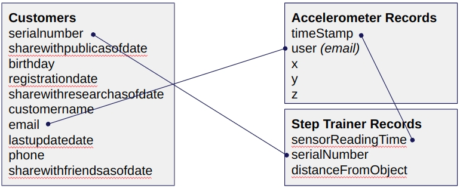

# Project 4 - Sparkify :: Data Warehouse on Airflow

### Table of Contents
- [Project Summary](#Project-Summary)
- [Repository](#Repository)
- [DAG](#Dag)
- [Operators](#Operators)

### Project Summary
A music streaming company, Sparkify, has decided that it is time to introduce more automation and monitoring to their data warehouse ETL pipelines and come to the conclusion that the best tool to achieve this is Apache Airflow.

The source data resides in S3 and needs to be processed in Sparkify's data warehouse in Amazon Redshift. The source datasets consist of JSON logs that tell about user activity in the application and JSON metadata about the songs the users listen to.

As a data engineer on the Sparkify team, we'll need to **create the ETL pipeline** 

### Repository

How the repository is organized
~~~~
dags/
    create_tables.py
    data_pipelines.py
plugins/    
    helpers/
        ddl_sql_statements.py
        dml_sql_statements.py
    custom_operators/
        __init__.py
        data_quality.py
        load_dimension.py
        load_fact.py
        stage_redshift.py
.gitignore
README.md 
~~~~

### DAG

The DAG was configurated according to the following guidelines:

- The DAG does not have dependencies on past runs
- On failure, the task are retried 3 times
- Retries happen every 5 minutes
- Catchup is turned off
- Do not email on retry

### Operators

Stage Operator

The stage operator is expected to be able to load any JSON-formatted files from S3 to Amazon Redshift. The operator creates and runs a SQL COPY statement based on the parameters provided. The operator's parameters should specify where in S3 the file is loaded and what is the target table.

The parameters should be used to distinguish between JSON files. Another important requirement of the stage operator is containing a templated field that allows it to load timestamped files from S3 based on the execution time and run backfills.
Using the AWS glue Data Catalog, glue tables were created to access the data with AWS Athena:

    

Fact and Dimension Operators

With dimension and fact operators, you can utilize the provided SQL helper class to run data transformations. Most of the logic is within the SQL transformations, and the operator is expected to take as input a SQL statement and target database on which to run the query against. You can also define a target table that will contain the results of the transformation.

Dimension loads are often done with the truncate-insert pattern, where the target table is emptied before the load. Thus, you could also have a parameter that allows switching between insert modes when loading dimensions. Fact tables are usually so massive that they should only allow append type functionality.

Data Quality Operator

The final operator to create is the data quality operator, which runs checks on the data itself. The operator's main functionality is to receive one or more SQL based test cases along with the expected results and execute the tests. For each test, the test result and expected result need to be checked, and if there is no match, the operator should raise an exception, and the task should retry and fail eventually.

For example, one test could be a SQL statement that checks if a certain column contains NULL values by counting all the rows that have NULL in the column. We do not want to have any NULLs, so the expected result would be 0, and the test would compare the SQL statement's outcome to the expected result.

    

